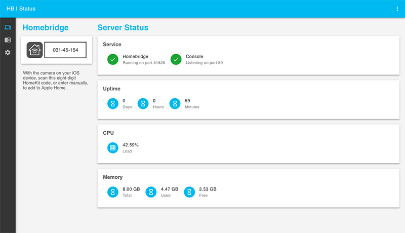
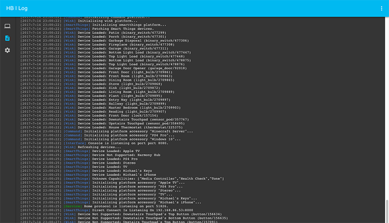
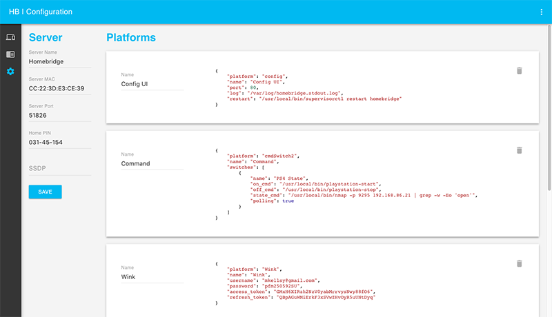

# Homebridge Config UI

This is a plugin for [Homebridge](https://github.com/nfarina/homebridge)

This plugin allows you to monitor, backup and configure your Homebridge server from a browser.



# Installation Instructions

First install the plugin
```Bash
sudo npm i -g homebridge-config-ui
```

### For Supervisord

Add this to your ~/.homebridge/config.json file
```JSON
{
    "platform": "config",
    "name": "Config",
    "port": 8080,
    "log": "/var/log/homebridge.stdout.log",
    "error_log": "/var/log/homebridge.stderr.log",
    "restart": "/usr/local/bin/supervisorctl restart homebridge",
    "temp": "/sys/class/thermal/thermal_zone0/temp"
}
```

This example uses [supervisor](http://supervisord.org/) to control homebridge. This is a good supervisor how to: [Running Supervisor on OSX](https://nicksergeant.com/running-supervisor-on-os-x/)

Replace <b>/var/log/homebridge.stdout.log</b> with the path to your Homebridge output log.<br />
Replace <b>/var/log/homebridge.stderr.log</b> with the path to your Homebridge error log.<br />
Replace <b>/usr/local/bin/supervisorctl restart homebridge</b> with the command you use to restart Homebridge.<br />
Replace <b>/sys/class/thermal/thermal_zone0/temp</b> with the command you use to check the CPU Temperature.

### For Systemd

Add this to your /var/homebridge/config.json file
```JSON
{
    "platform": "config",
    "name": "Config",
    "port": 8080,
    "log": "/var/log/daemon.log",
    "restart": "sudo systemctl restart homebridge.service",
    "temp" : "/sys/class/thermal/thermal_zone0/temp"
}
```

Replace <b>/var/log/daemon.log</b> with the path to your Homebridge output log.<br />
Replace <b>sudo systemctl restart homebridge.service</b> with the command you use to restart Homebridge.<br />
Replace <b>/sys/class/thermal/thermal_zone0/temp</b> with the command you use to check the CPU Temperature.

# Initial Run

Once installed you can open the interface at http://localhost:8080. The default username is <b>admin</b> and the default password is <b>admin</b>.

# Usage

Login Screen

Most of your platform configs have usernames and passwords in them. To keep these seceret, this plugin has basic authentication. The users are stored in the ~/.homebridge/auth.json file.


Status Screen

This shows you that the services are running. It also has your HomeKit pin.


Log Screen

This shows you the rolling log. This is helpful for troubleshooting.



Configuration Screen

And finally the configuration screen allows you to modify your Homebridge settings and your platforms and accessories.


