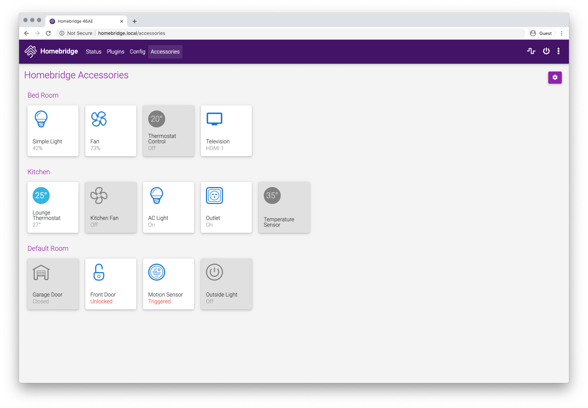
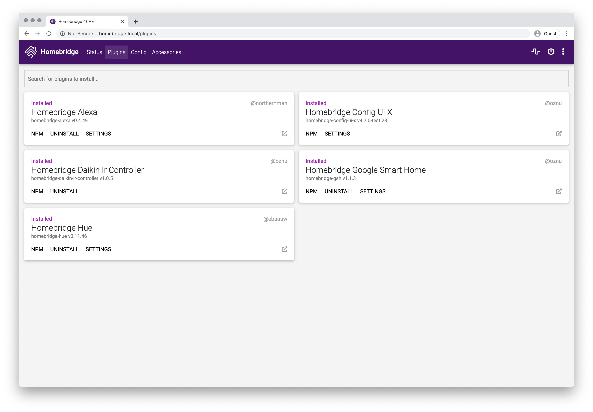

[](https://www.npmjs.com/package/homebridge-config-ui-x) 
[](https://www.npmjs.com/package/homebridge-config-ui-x)
[](https://www.paypal.com/cgi-bin/webscr?cmd=_s-xclick&hosted_button_id=ZEW8TFQCU2MSJ&source=url)

Supported Languages: :gb: :de: :fr: :poland: :czech_republic: :ru: :cn: :hungary: :jp: :es: :netherlands: :tr: :it:

# Homebridge Config UI X

This is a plugin for [Homebridge](https://github.com/nfarina/homebridge). This is a fork of the work originally done by [mkellsy](https://github.com/mkellsy/homebridge-config-ui).

This plugin allows you to monitor, backup and configure your Homebridge server from a browser.

[](#accessory-control)

## Installation Instructions

```
sudo npm install -g --unsafe-perm homebridge-config-ui-x
```

Once you have installed and configured the plugin you can access the interface via http://localhost:8080. 

The default username is `admin` and the default password is `admin`.

# Configuration

Add this to your homebridge `config.json` file

```json
"platforms": [
    {
      "platform": "config",
      "name": "Config",
      "port": 8080,
      "sudo": false
    }
]
```

**Optional Settings**

* `log` - [See below for details](#log-viewer-configuration).
* `sudo` - [See below for details](#sudo-mode).
* `restart` - The command to run when a restart request is sent from the browser. If not populated it will just terminate the Homebridge process and let your process manager (like systemd) restart it.
* `temp` - The path to the file that can display your current CPU temperature in WEB UI. eg. `/sys/class/thermal/thermal_zone0/temp`
* `theme` - [See wiki for details](https://github.com/oznu/homebridge-config-ui-x/wiki/Themes)
* `ssl` - [See below for details](#enabling-ssl)

All config options are [listed here](https://github.com/oznu/homebridge-config-ui-x/wiki/Config-Options).

## Accessory Control

The plugin allows you to view and control some types of Homebridge accessories from your web browser. 

To [enable accessory control](https://github.com/oznu/homebridge-config-ui-x/wiki/Enabling-Accessory-Control) you must be running Homebridge in insecure mode:

```
homebridge -I
```

*Insecure mode, as it's name suggests, is not secure. Anyone with network access to your Homebridge server port and pin will be able to control your accessories. Unless exposing the Homebridge port to the internet, this will generally not be a problem as access will be limited to people already on your local network. Remote access via a home hub (Apple TV, iPad, HomePod etc.) will still be secure. Enable at your own risk.*

Not all accessory types are supported. See [this issue](https://github.com/oznu/homebridge-config-ui-x/issues/47) for a full list of supported accessory types.

## Log Viewer Configuration

Homebridge Config UI X allows you to view the homebridge process logs in the browser. These logs can be loaded from a file or from a command.

### Logs From File

Example loading logs from a file, change `/var/log/homebridge.log` to the actual location of your log file:

```json
"platforms": [
    {
      "platform": "config",
      "name": "Config",
      "port": 8080,
      "log": {
        "method": "file",
        "path": "/var/log/homebridge.log"
      }
    }
]
```

*Make sure the user which is running the Homebridge process has the correct permissions to read the log file. You may need to enable the [sudo option](#sudo-mode) to avoid permission errors if you are not running Homebridge as root.*

### Logs From Systemd

If you're using `systemd` to manage the Homebridge process then you can just set the `method` to `systemd`:

```json
"platforms": [
    {
      "platform": "config",
      "name": "Config",
      "port": 8080,
      "restart": "sudo -n systemctl restart homebridge",
      "log": {
        "method": "systemd",
        "service": "homebridge"
      }
    }
]
```

*You may need to enable the [sudo option](#sudo-mode) to avoid permission errors if you are not running Homebridge as root.*

### Logs From Custom Command

The `log` option can alternatively specify a command to spawn that will stream the logs to the client. This command should stream the logs to `stdout`:

```json
"platforms": [
    {
      "platform": "config",
      "name": "Config",
      "port": 8080,
      "log": {
        "method": "custom",
        "command": "sudo -n tail -n 100 -f /var/log/homebridge.log"
      }
    }
]
```

## Sudo Mode

Many operations performed by Homebridge Config UI X, such as installing plugins, upgrading Homebridge and viewing the logs can require root permissions. You can run the Homebridge service as root or you can enable the `sudo` option in the config.

```json
"platforms": [
    {
      "platform": "config",
      "name": "Config",
      "port": 8080,
      "sudo": true
    }
]
```

When `sudo` mode is enabled Homebridge Config UI X will use `sudo` when executing installing, removing or upgrading plugins, viewing the logs using the [Logs From File](#logs-from-file) or [Logs From Systemd](#logs-from-systemd) method, and when upgrading Homebridge. It will not be used for [Logs From Custom Command](#logs-from-custom-command) or custom restart commands.

### Password-less sudo required

For `sudo` mode to work password-less sudo is required. You can enable password-less sudo by adding this entry to the bottom of your `/etc/sudoers` file (use `visudo` to edit the file!):

```
homebridge    ALL=(ALL) NOPASSWD: ALL
```

*Replace `homebridge` with the actual user you are running Homebridge as.*

## Enabling SSL

You can run this plugin over an encrypted HTTPS connection by configuring the `ssl` options.

```json
"platforms": [
    {
      "platform": "config",
      "name": "Config",
      "port": 8080,
      "ssl": {
        "key": "/path/to/privkey.pem",
        "cert": "/path/to/fullchain.pem"
      }
    }
]
```

Or if using a **PKCS#12** certificate you can setup SSL like this:

```json
"platforms": [
    {
      "platform": "config",
      "name": "Config",
      "port": 8080,
      "ssl": {
        "pfx": "/path/to/cert.pfx",
        "passphrase": "sample"
      }
    }
]
```

# Usage

### Status Screen

This shows you that the services are running. It also has your HomeKit pin.


### Log Screen

This shows you the rolling log. This is helpful for troubleshooting.


### Plugin Screen

This shows you the currently installed plugins and allows you to install, remove and upgrade plugins.



When installing, removing or upgrading plugins the output is show in the browser to help troubleshoot any issues.


### Configuration Screen

And finally the configuration screen allows you to modify your Homebridge settings and your platforms and accessories.


# Supported Browsers

The following browsers are supported by this plugin:

* Safari >= 10
* Chrome >= 55 (including Opera)
* FireFox >= 58
* MS Edge >= 13 on the desktop
* iOS >=10 and Chrome on mobile

MS Internet Explorer (any version) is not supported!

# Supported Node.js Versions

The following versions of Node.js are supported:

**Due to [#279](https://github.com/oznu/homebridge-config-ui-x/issues/277) Node.js 12 is not currently supported on any platform.**

* Linux >= v8.15.1
* Windows >= v10.15.3

# Contributing

Please see [CONTRIBUTING.md](CONTRIBUTING.md).

# Troubleshooting

#### 1. Errors during installation

Make sure you installed the package with `sudo` and used the  `--unsafe-perm` flag. Most installation errors can be fixed by removing the plugin and reinstalling:

```shell
# cleanup
sudo npm uninstall -g homebridge-config-ui-x

# reinstall
sudo npm install -g --unsafe-perm homebridge-config-ui-x
```

#### 2. Accessories tab missing

If the Accessories tab is not show then you are not running Homebridge in insecure mode. See the [Enabling Accessory Control](https://github.com/oznu/homebridge-config-ui-x/wiki/Enabling-Accessory-Control) wiki for details. If you have just enabled insecure mode make sure you have restarted Homebridge and refreshed the page in your browser.

#### 3. Running in Docker

This plugin supports the [oznu/homebridge](https://github.com/oznu/docker-homebridge) Docker image. You must enable the UI using the method described in [the wiki](https://github.com/oznu/homebridge-config-ui-x/wiki/Enabling-UI-with-Docker).

#### 4. Ask on Slack

[](https://slackin-znyruquwmv.now.sh)

Join the [Homebridge Slack](https://slackin-znyruquwmv.now.sh/) chat and ask in the [#ui](https://homebridgeteam.slack.com/messages/C9NH0CUTY) channel.
