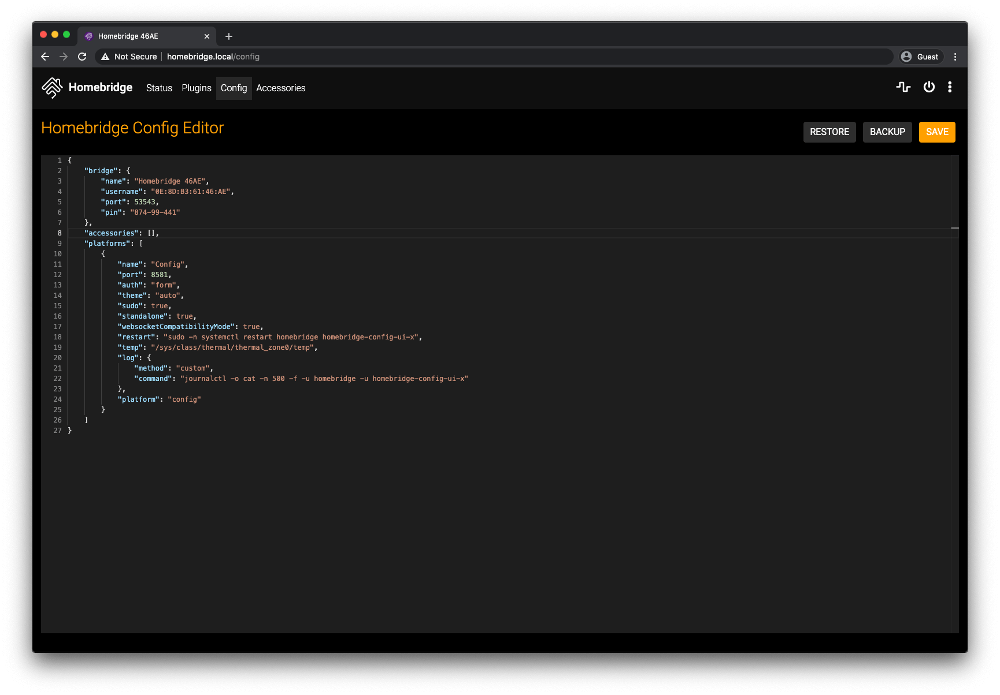

[](https://www.npmjs.com/package/homebridge-config-ui-x)

# homebridge-config-ui-x

This is a plugin for [Homebridge](https://github.com/nfarina/homebridge)

This plugin allows you to monitor, backup and configure your Homebridge server from a browser.


This is a fork of the work originally done by [mkellsy/homebridge-config-ui](https://github.com/mkellsy/homebridge-config-ui) and provides the following improvements:

* Plugin discovery is improved with support added multiple plugin locations
* Log display performance improved, now using web sockets to display logs in real time
* Added option to display logs from journalctl
* Refactored code with ES6

# Installation Instructions

```
npm install -g homebridge-config-ui-x
```

### Configuration

Add this to your homebridge `config.json` file

```json
"platform":[
    {
      "platform": "config",
      "name": "Config",
      "port": 8080
    }
]
```

**Optional Settings**

* `log` - The path to the homebridge log. Required if you want to see the process logs in the browser. eg. `/var/log/daemon.log`
* `restart` - The command to run when a restart request is sent from the browser. If not populated it will just terminate the homebridge process.
* `temp` - The path to the file that can display your current CPU temperature. eg. `/sys/class/thermal/thermal_zone0/temp`

### Log Viewer Configuration

* The path to the log file will vary from system to system, check the guide you used to setup the Homebridge process to find where this is.
* Make sure the user which is running the Homebridge process has the correct permissions to read the log file.
* The `stdout` and `stderr` streams should be logged to the same file. This app only supports reading from a single file.

The `log` option can alternatively specify a command to spawn that will stream the logs to the client. For example to stream logs from a setup using `system.d` and `journald` use this config:

```json
"platform":[
    {
      "platform": "config",
      "name": "Config",
      "port": 8080,
      "log": {
        "tail": "journalctl -o cat -n 100 -f -u homebridge"
      }
    }
]
```

In this case the user which is running the Homebridge process **must** have access to read the logs from `journalctl`.

# Initial Run

Once installed you can open the interface at http://localhost:8080. The default username is `admin` and the default password is `admin`.

# Usage

### Login Screen

Most of your platform configs have usernames and passwords in them. To keep these secret, this plugin has basic authentication. The users are stored in the `~/.homebridge/auth.json` file.


### Status Screen

This shows you that the services are running. It also has your HomeKit pin.


### Log Screen

This shows you the rolling log. This is helpful for troubleshooting.


### Plugin Screen

This shows you the currently installed plugins and allows you to install, remove and upgrade plugins.


### Configuration Screen

And finally the configuration screen allows you to modify your Homebridge settings and your platforms and accessories.


