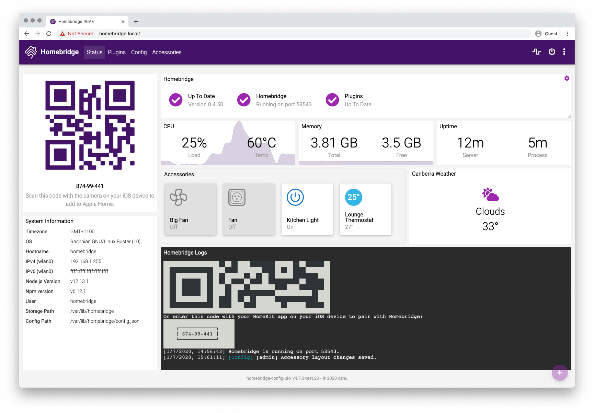
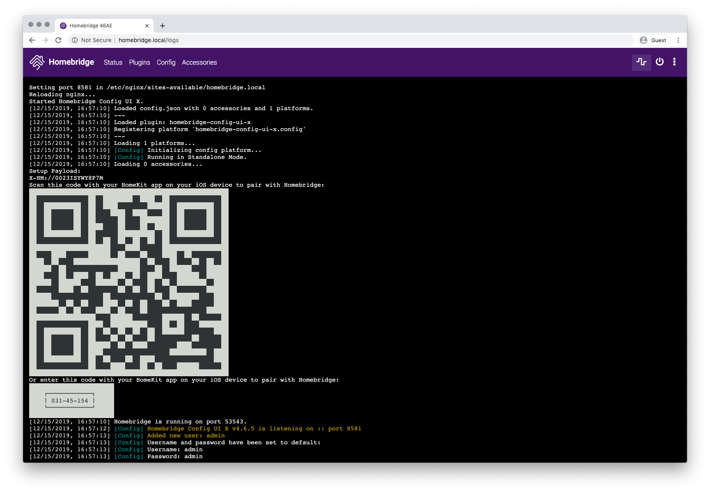

[](https://www.npmjs.com/package/homebridge-config-ui-x)

# Homebridge Config UI X

This is a plugin for [Homebridge](https://github.com/nfarina/homebridge)

This plugin allows you to monitor, backup and configure your Homebridge server from a browser.



This is a fork of the work originally done by [mkellsy/homebridge-config-ui](https://github.com/mkellsy/homebridge-config-ui) and provides the following improvements and more:

* Plugin discovery is improved with support added multiple plugin locations
* Log display performance improved, now using web sockets to display logs in real time
* Added option to display logs from journalctl
* Passwords are no longer stored in plain text
* Refactored code with ES6
* Rebuilt user interface using Angular 5

## Installation Instructions

```
npm install -g --unsafe-perm homebridge-config-ui-x
```

## Configuration

Add this to your homebridge `config.json` file

```json
"platform":[
    {
      "platform": "config",
      "name": "Config",
      "port": 8080,
      "sudo": false
    }
]
```

**Optional Settings**

* `log` - [See below for details](#log-viewer-configuration).
* `sudo` - [See below for details](#sudo-mode).
* `restart` - The command to run when a restart request is sent from the browser. If not populated it will just terminate the Homebridge process and let your process manager (like systemd) restart it.
* `temp` - The path to the file that can display your current CPU temperature. eg. `/sys/class/thermal/thermal_zone0/temp`

## Log Viewer Configuration

Homebridge Config UI X allows you to view the homebridge process logs in the browser. These logs can be loaded from a file or from a command.

### Logs From File

Example loading logs from a file, change `/var/log/homebridge.log` to the actual location of your log file:

```json
"platform":[
    {
      "platform": "config",
      "name": "Config",
      "port": 8080,
      "log": "/var/log/homebridge.log"
    }
]
```

*Make sure the user which is running the Homebridge process has the correct permissions to read the log file. You may need to enable the [sudo option](#sudo-mode) to avoid permission errors if you are not running Homebridge as root.*

### Logs From Systemd

If you are using `systemd` to manage the Homebridge process then you can just set `log` to `systemd`:

```json
"platform":[
    {
      "platform": "config",
      "name": "Config",
      "port": 8080,
      "restart": "sudo -n systemctl restart homebridge",
      "log": "systemd"
    }
]
```

*This will only work if your `systemd` service has the name `homebridge`. You may need to enable the [sudo option](#sudo-mode) to avoid permission errors if you are not running Homebridge as root.*

### Logs From Custom Command

The `log` option can alternatively specify a command to spawn that will stream the logs to the client. This command should stream the logs to `stdout`:

```json
"platform":[
    {
      "platform": "config",
      "name": "Config",
      "port": 8080,
      "log": {
        "tail": "sudo -n tail -n 100 -f /var/log/homebridge.log"
      }
    }
]
```

## Sudo Mode

Many operations performed by Homebridge Config UI X, such as installing plugins, upgrading Homebridge and viewing the logs can require root permissions. You can run the Homebridge service as root or you can enable the `sudo` option in the config.

```json
"platform":[
    {
      "platform": "config",
      "name": "Config",
      "port": 8080,
      "sudo": true
    }
]
```

When `sudo` mode is enabled Homebridge Config UI X will use `sudo` when executing installing, removing or upgrading plugins, viewing the logs using the [Logs From File](#logs-from-file) or [Logs From Systemd](#logs-from-systemd) method, and when upgrading Homebridge. It will not be used for [Logs From Custom Command](#logs-from-custom-command) or custom restart commands.

### Password-less sudo required

For `sudo` mode to work password-less sudo is required. You can enable password-less sudo be adding this entry to the bottom of your `/etc/sudoers` file (use `visudo` to edit the file!):

```
homebridge    ALL=(ALL) NOPASSWD: ALL
```

*Replace `homebridge` with the actual user you are running Homebridge as.*

# Initial Run

Once installed you can open the interface at http://localhost:8080. The default username is `admin` and the default password is `admin`.

# Usage

### Status Screen

This shows you that the services are running. It also has your HomeKit pin.


### Log Screen

This shows you the rolling log. This is helpful for troubleshooting.



### Plugin Screen

This shows you the currently installed plugins and allows you to install, remove and upgrade plugins.


When installing, removing or upgrading plugins the output is show in the browser to help troubleshoot any issues.


### Configuration Screen

And finally the configuration screen allows you to modify your Homebridge settings and your platforms and accessories.


